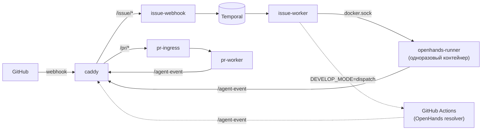
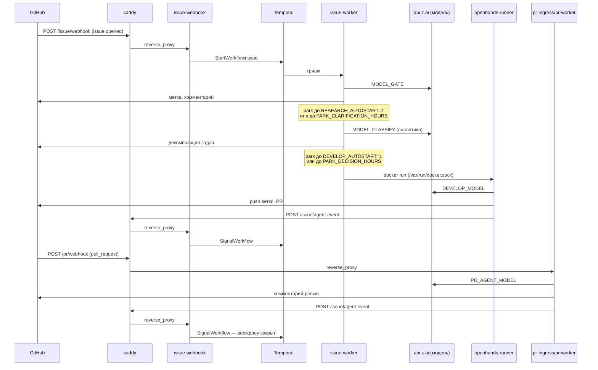

# Релизная заметка: харнесс контура автоматизации Issue → PR

Материал для DevOps и СБ перед развёртыванием в корпоративной инфраструктуре.
Факты сверены с `harness/docker-compose.yml`, `harness/.env.example`,
`harness/Caddyfile`, `harness/register-app.html`, `harness/host/` и опытом
эксплуатации демонстрационного стенда.

## Архитектура

Один Docker Compose стек, три слоя.

| Слой | Компоненты | Роль |
|---|---|---|
| Вход | `caddy` | единственный публичный процесс; разводит домен на 4 пути, решений не принимает |
| Оркестрация | `postgres`, `temporal`, `temporal-ui` | состояние заявки — история событий Temporal, не строка в таблице |
| Исполнение | `issue-worker`, `openhands-runner`, `pr-ingress`/`pr-worker`/`pr-sweeper` (профиль `pr`) | вызовы модели, генерация кода, ревью PR |

Обратная связь от слоя исполнения к оркестрации идёт не напрямую, а через
вход: `/issue/agent-event`, подпись `AGENT_EVENT_SECRET`.



Issue-Agent и PR-Agent — отдельные репозитории
(`po-helper-org/poh-issue-agents`, `po-helper-org/poh-pr-agents`), харнесс их
не копирует, а собирает `docker build` из git на этапе `docker compose up
--build` (см. «Зависимости»). Полный цикл — `harness/README.md`.

### Сквозной прогон заявки



Обе паузы — не подвисание, а парковка с дедлайном (`PARK_*_HOURS`). Оба
автостарта включены → цикл идёт без касания человека. `DEVELOP_MODE=dispatch`
заменяет шаг `Runner` на `workflow_dispatch` в Actions целевого репозитория.

## Компоненты стека

| Сервис | Образ / сборка | Обязателен |
|---|---|---|
| `postgres` | `postgres:16` | да |
| `temporal` | `temporalio/auto-setup:1.24` | да |
| `temporal-ui` | `temporalio/ui:2.31.2` | да |
| `issue-webhook` | сборка, `poh-issue-agents/webhook/Dockerfile` | да |
| `issue-worker` | сборка, `poh-issue-agents/worker/Dockerfile` | да |
| `openhands-runner` | сборка, `poh-issue-agents/openhands/Dockerfile` | да (как образ, не служба) |
| `caddy` | `caddy:2-alpine` | да |
| `pr-agent-base` | сборка, апстрим `qodo-ai/pr-agent` | только профиль `pr` |
| `pr-ingress`/`pr-worker`/`pr-sweeper` | сборка, `poh-pr-agents/self-hosted/` | только профиль `pr` |

Источник правды — `harness/docker-compose.yml`.

## Конфигурация

Один `.env` на стек: шаблон `harness/.env.example`, построчный справочник
`docs/harness/configuration.md`.

| Переменная | Обязательна | Поведение при пропуске |
|---|---|---|
| `WATCHED_REPOS` | да | `docker compose up` падает сразу, до сборки образов |
| `ISSUE_APP_WEBHOOK_SECRET` | да (или `GH_TOKEN`) | без App — работает по PAT, действия идут от имени человека |
| `PR_APP_ID`/`PR_APP_PRIVATE_KEY_B64`/`PR_APP_WEBHOOK_SECRET` | да для профиля `pr` | профиль `pr` не поднимается вовсе (guard на старте) |
| `AGENT_EVENT_SECRET` | да | пусто → `/agent-event` отвечает 503, остальное работает, задачи «зависают» в `in-development` без ошибок |
| `ZAI_API_KEY` | да | сборка проходит, вызовы модели падают в рантайме |
| `POSTGRES_PASSWORD` | да | падение на старте `postgres` |
| `DRY_RUN` | нет, умолч. `1` | боевой режим — пустая строка, НЕ `0`; `DRY_RUN=0` сухой прогон не выключает |
| `DEVELOP_ENABLED`/`RESEARCH_AUTOSTART`/`DEVELOP_AUTOSTART`/`DEVELOP_MODE`/`AGENT_TRIGGER_ALLOWLIST` | нет | управляют автономностью цикла |
| `HARNESS_PORT`/`HARNESS_HOST`/`PUBLIC_URL`/`TEMPORAL_UI_PORT` | нет | сеть/адреса |
| `SENTRY_DSN`/`SENTRY_ORG`/`SENTRY_ENVIRONMENT` | нет | пусто = выключено, это и процедура отката |

Учётка Temporal UI (`TEMPORAL_UI_USER`/`TEMPORAL_UI_PASSWORD_HASH`)
сознательно не в `.env` — отдельный файл вне рабочей копии
(`/etc/poh-harness/temporal-ui-auth.env` на демо-стенде,
`harness/caddy.env` локально), потому что панель деплоя перезаписывает
`.env` целиком. Детали — `configuration.md`.

## Инструкция развёртывания

Полная версия — `harness/DOKPLOY.md` (постоянный стенд), `harness/LOCAL.md`
(локально).

1. Docker Engine + Compose v2 (директива `build` недоступна `stack`).
2. `cp harness/.env.example .env`, заполнить обязательные переменные.
3. Домен → сервис `caddy`, порт 80. `HARNESS_HOST`/`PUBLIC_URL` = тот же адрес.
4. Два GitHub App: Issue-Agent — форма `harness/register-app.html`; PR-Agent —
   по документации апстрима `qodo-ai/pr-agent`.
5. В каждом репозитории из `WATCHED_REPOS`: секреты `ISSUE_AGENT_URL`,
   `AGENT_EVENT_SECRET`, ключ модели.
6. `docker compose up -d --build` (`--profile pr` — если PR-Agent как сервис).
7. Проверка по цепочке:

```bash
D=https://<домен>
curl -fsS "$D/health"                                                    # харнесс жив
curl -s -o /dev/null -w '%{http_code}\n' -X POST "$D/issue/webhook"      # 401/422 = приём живой
curl -s -o /dev/null -w '%{http_code}\n' -X POST "$D/issue/agent-event"  # 401 = секрет задан, 503 = не задан
curl -s -o /dev/null -w '%{http_code}\n' "$D/"                            # 401 = вход в UI закрыт паролем
```

Автодеплоя нет: новая версия агента — пересборка образа с пином коммита,
вручную или пайплайном, который ещё предстоит завести DevOps.

## Наблюдаемость и мониторинг

Встроенного экспортёра метрик (Prometheus и подобных) в стеке нет.

| Сигнал | Где | Что означает |
|---|---|---|
| `GET /health` | `caddy` отвечает напрямую | 200 = жив хотя бы прокси |
| `POST /issue/agent-event` | код ответа | 401 = секрет задан и работает; **503 = самая дорогая ошибка** — цикл продолжает работать, задачи молча перестают закрываться |
| Temporal UI | корень домена, basic-auth | история событий заявки, `Nondeterminism error` после чужой выкладки, поиск по `RootIssue`/`Repo` (если включены `TEMPORAL_SEARCH_ATTRIBUTES`) |
| `PARK_*_HOURS` | Temporal search attributes | заявка старше дедлайна парковки (72/48/72/168 ч по умолчанию) без движения = пропущена, а не «в работе» |
| `docker logs <issue-webhook> \| grep "ignored repo"` | после приёма события | репозиторий не прошёл `ISSUE_AGENT_REPOS`; GitHub видел 200, без grep отказ неотличим от «события не было» |
| `docker logs <issue-worker> \| grep -i nondetermin` | сразу после выкладки | воркфлоу, чья история разошлась с новым кодом, перестаёт отвечать на сигналы |
| `docker ps \| grep openhands` | после выкладки | контейнер агента разработки пережил убитый воркер, держит ключ модели и память |
| Sentry (`SENTRY_DSN`) | опционально, выключен по умолчанию | без `SENTRY_ORG` ссылка на событие в комментарии не собирается, только голый id |
| `free -m` (`available`) | хост | ниже ~500 МБ на демо-стенде = `docker compose build` не укладывается в 10 минут; отдельного счётчика в стеке нет |

## Сетевые доступы

**Входящие** — только `caddy`, порт 80/443:

| Источник | Путь | Назначение |
|---|---|---|
| GitHub | `/issue/webhook`, `/pr/webhook` | вебхуки |
| OpenHands (Actions), PR-Agent | `/issue/agent-event` | доклад о результате, подпись `AGENT_EVENT_SECRET` |
| Оператор | `/` | Temporal UI, basic-auth |
| Мониторинг | `/health` | живость |

`postgres` (5432), `temporal` (7233) не публикуют портов (`expose`, не
`ports`); `temporal-ui` прямой порт (8233) — только `127.0.0.1`. Проверить
отдельно на целевом хосте, если периметр — NAT/security group.

**Исходящие:**

| Куда | Зачем | Когда |
|---|---|---|
| `github.com`, `api.github.com` | вебхуки, API, клонирование исходников при сборке образов | постоянно + сборка |
| `api.z.ai` (`/api/coding/paas/v4`, `/api/anthropic`) | вызовы модели | постоянно |
| Sentry | доставка ошибок | опционально |
| Docker Hub/GHCR, `registry.npmjs.org`, релизы GitHub CLI/Claude Code | сборка образов | только `docker compose build` |
| `acme-v02.api.letsencrypt.org` | выпуск TLS-сертификата | если автовыпуск через Traefik |

Референс изоляции от соседних стеков на общем хосте —
`harness/host/poh-harness-isolation.sh` (`iptables`/`DOCKER-USER`, режет
RFC1918 из подсети контура). В выделенном корпоративном сегменте эквивалент
даёт сетевая сегментация инфраструктуры, а не этот скрипт.

## Вычислительные ресурсы

Цифры — с демо-стенда (внешняя VM), не гарантированный SLA. Профиль
ожидаемой нагрузки в корпоративном контуре не зафиксирован.

| Что | Значение |
|---|---|
| Сборка образов | ~4 ГБ ОЗУ билдеру; образ `issue-worker` (Node.js + GitHub CLI + Claude Code) ~1.6 ГБ |
| `issue-worker` в покое | ~286 МБ RSS |
| Один вызов `claude -p` | ~356 МБ RSS — дороже контейнера воркера |
| Демо-стенд целиком | ~8 ГБ ОЗУ впритык; несколько `claude -p` + контейнер разработки → сборка не укладывается в 10 мин |
| `pgdata`, рост от истории воркфлоу | не измерялся |

Прогнать нагрузочный сценарий на целевом классе инстансов перед фиксацией
лимитов — цифры демо-стенда занижены (общий хост, делит память с посторонним
сервисом).

## Используемые зависимости

Базовые образы с версией из `docker-compose.yml`: `postgres:16`,
`temporalio/auto-setup:1.24`, `temporalio/ui:2.31.2`, `caddy:2-alpine`.

Свои образы собираются из git на этапе `build`
(`ISSUE_AGENT_CONTEXT=…/poh-issue-agents.git#main`, аналогично `PR_AGENT_CONTEXT`
и апстрим `qodo-ai/pr-agent`) — сеть сборки должна иметь доступ к GitHub, а
цепочка поставки включает три внешних git-репозитория, два своих и один
чужой. Для корпоративного контура — зеркалирование во внутренний Git либо
исключение в политике egress на время сборки.

Внутри `issue-worker`: Node.js, GitHub CLI, Claude Code CLI. Часть стадий
(`BFT_DIRECT_STAGES`) вызывает модель напрямую по HTTP, часть — через
`claude -p`.

**Провайдер модели — z.ai, не Anthropic**, несмотря на имя CLI: и Python-код,
и CLI обращаются к `api.z.ai` тем же `ZAI_API_KEY`, модели линейки GLM
(`glm-4.6`, `glm-4.5-air`). Трафика к `api.anthropic.com` нет. Юрисдикция и
статус провайдера данных, уходящих в промпты (код репозитория, текст Issue) —
другие, чем при интеграции с Anthropic напрямую.

## Права доступа

**GitHub App «Issue-Agent»** (манифест — `harness/register-app.html`):

| Право | Уровень |
|---|---|
| `issues` | write |
| `pull_requests` | write |
| `contents` | write |
| `actions` | write (диспатч в `DEVELOP_MODE=dispatch`) |
| `metadata` | read |

События: `issues`, `issue_comment`, `label`, `pull_request`, `push`,
`sub_issues`. Запасной путь — `GH_TOKEN` (PAT): действия идут от имени
человека-владельца токена, не бота.

**GitHub App «PR-Agent»** — регистрируется отдельно, по документации
апстрима `qodo-ai/pr-agent`: обычно чтение содержимого/метаданных PR, запись
комментариев и ревью, чтение проверок. Точный манифест не завезён в этот
репозиторий.

**`AGENT_EVENT_SECRET`** — симметричный секрет канала `/agent-event`, общий
для доклада PR-Agent и прогона OpenHands в Actions. Хранится в `.env`
харнесса и секретом в каждом репозитории из `WATCHED_REPOS`; ротация —
одновременно в обоих местах.

**`issue-worker` монтирует `/var/run/docker.sock`** — равносильно доступу
уровня root на хосте (держатель сокета поднимает произвольный контейнер с
любым монтированием). Компенсирующий контроль: сгенерированный код
исполняется не в `issue-worker`, а в одноразовом контейнере без
GitHub-токена и доступа к истории Temporal, живущем минуты. Решение принято
осознанно (комментарий в `docker-compose.yml`), но факт нужно предъявить
СБ явно.

**Temporal UI** — basic-auth на `caddy`, учётка вне общего `.env`. Прямой
порт без пароля, но только loopback.

## Известные ограничения

- Автодеплоя нет — новая версия агента требует пересборки образа с пином коммита.
- BuildKit кэширует git-клон по URL — пересборка после коммита в `#main` может молча взять старый код; нужен пин на SHA или `--no-cache`.
- Рестарт воркера посреди прогона Temporal может уронить воркфлоу (`Nondeterminism error`) или потерять heartbeat активности — детали `harness/STATUS.md`.
- PR-Agent как отдельный сервис нигде не эксплуатировался — единственный прогон использовал CI-шаг Actions, не профиль `pr`.

## Открытые вопросы к DevOps и СБ

- Модель угроз для доступа `issue-worker` к Docker-сокету хоста — приемлема ли архитектура, какая изоляция заменит компенсирующий контроль (отдельная VM/нода, gVisor/Kata).
- Провайдер модели z.ai (GLM) — согласован ли вывод кода/Issue во внешний сервис; альтернатива и её совместимость с форматом Claude Code CLI.
- Egress к GitHub при сборке образов — допустим `docker build` из публичного GitHub (включая сторонний `qodo-ai/pr-agent`), или нужно зеркалирование.
- Схема TLS/сертификатов — внутренний CA, wildcard-сертификат или свой балансировщик перед `caddy`.
- Ожидаемая нагрузка — репозитории и одновременные заявки, для лимитов CPU/RAM/диска.
- GitHub App vs `GH_TOKEN` — политика сервисных идентичностей.
- Хранение секретов — текущая схема (`.env` + файлы вне рабочей копии) рассчитана на Dokploy; нужна ли интеграция с корпоративным хранилищем.
- Регламент ротации `AGENT_EVENT_SECRET` и вебхук-секретов.

Готово к публикации, когда каждый пункт закрыт решением или явным принятием
риска от СБ/DevOps.

---

Связанные документы: `docs/harness/README.md`, `docs/harness/configuration.md`,
`docs/harness/endpoints.md`, `harness/DOKPLOY.md`, `harness/STATUS.md`.
