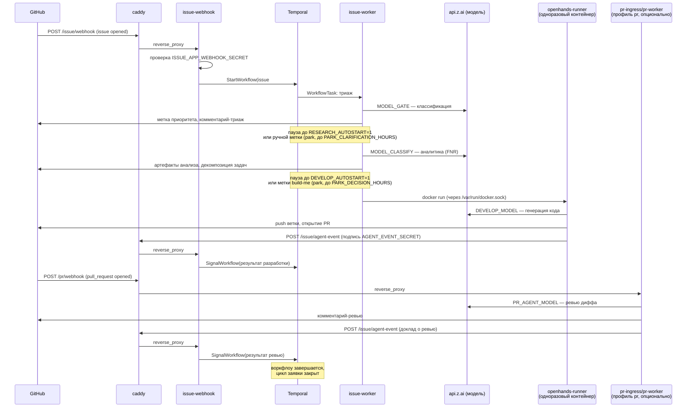

# Релизная заметка: харнесс контура автоматизации Issue → PR

Материал для DevOps и СБ перед развёртыванием в корпоративной инфраструктуре.
Факты сверены с `harness/docker-compose.yml`, `harness/.env.example`,
`harness/Caddyfile`, `harness/register-app.html`, `harness/host/` и опытом
эксплуатации демонстрационного стенда.

## Что это

Харнесс — один Docker Compose стек, связывающий три сервиса в цикл: GitHub
Issue → триаж → аналитика → разработка → Pull Request → ревью → доклад о
результате обратно в задачу.

```
GitHub ──webhook──▶ caddy ──/issue/*──▶ issue-webhook ──▶ Temporal ──▶ issue-worker
                      │                                                     │
                      │                                          workflow_dispatch
                      │                                                     ▼
                      └──/pr/*──▶ pr-ingress ─▶ pr-worker         OpenHands (Actions)
                                                    │                       │
                                                    └──── /agent-event ◀────┘
```

Issue-Agent принимает вебхуки GitHub и ведёт заявку по стадиям как воркфлоу
Temporal. Temporal — движок долгоживущих процессов: свой `postgres`,
`temporal`, `temporal-ui`, состояние заявки — история событий, а не строка в
таблице. PR-Agent (профиль `pr`, опционален) ревьюит открытые Pull Request.
Caddy — единственная публичная точка входа, разводит один домен на четыре
внутренних адреса. Полная архитектура и цикл — `harness/README.md`.

Issue-Agent и PR-Agent живут в отдельных репозиториях
(`po-helper-org/poh-issue-agents`, `po-helper-org/poh-pr-agents`). Харнесс их
не копирует, а собирает `docker build` прямо из git на этапе `docker compose
up --build` — см. риск цепочки поставки в разделе о зависимостях.

Верхнеуровнево систему держат три слоя. Слой входа — `caddy`, единственный
процесс, слушающий наружу; он не принимает решений, только разводит четыре
пути на четыре внутренних сервиса и отдаёт `/health`. Слой оркестрации —
Temporal (`postgres` + `temporal` + `temporal-ui`): каждая заявка — это
воркфлоу, его состояние — история событий в Postgres, а не поле в таблице,
поэтому рестарт любого сервиса не теряет прогресс заявки (но может, при
неосторожной выкладке, разойтись с историей — см. «Известные ограничения»).
Слой исполнения — `issue-worker` (вызывает модель, ведёт стадии), одноразовые
контейнеры `openhands-runner` (пишут код) и, при включённом профиле `pr`,
`pr-ingress`/`pr-worker`/`pr-sweeper` (ревьюят PR). Обратная связь от слоя
исполнения к слою оркестрации идёт не напрямую, а через тот же вход:
`/issue/agent-event`, подписанный `AGENT_EVENT_SECRET`, — то есть даже
внутренний доклад о результате шага физически проходит через `caddy`.

### Сквозной прогон заявки



Каждая пауза на диаграмме — не подвисание, а осознанная парковка с дедлайном
(`PARK_*_HOURS`); если обе переменные автостарта включены, обе паузы
пропускаются и заявка идёт от issue до PR без касания человека. Ветвь
`DEVELOP_MODE=dispatch` (не показана отдельно) заменяет шаг `Runner` на
`workflow_dispatch` в GitHub Actions целевого репозитория — тот же
`/agent-event` в конце, только исполнитель кода снаружи харнесса.

## Компоненты стека

`postgres:16` — БД Temporal. `temporalio/auto-setup:1.24` — движок воркфлоу.
`temporalio/ui:2.31.2` — консоль оператора. `caddy:2-alpine` — реверс-прокси.
Эти четыре — готовые образы без сборки.

Свои: `issue-webhook` и `issue-worker` собираются из `poh-issue-agents`
(`webhook/Dockerfile`, `worker/Dockerfile`) — приём вебхуков и исполнение
воркфлоу с вызовами модели соответственно. `openhands-runner` — образ для
одноразового контейнера агента разработки (`openhands/Dockerfile`); сам он
не «служит», используется как шаблон для `docker run`.

Профиль `pr` (не обязателен для базового цикла): `pr-agent-base` собирается
из апстрима `qodo-ai/pr-agent`, `pr-ingress`/`pr-worker`/`pr-sweeper` — из
`poh-pr-agents/self-hosted/`. Приём вебхуков PR, очередь ревью, доретрай
пропущенного.

Источник правды по составу — `harness/docker-compose.yml`.

## Конфигурация

Один файл `.env` на весь стек, шаблон с комментариями —
`harness/.env.example`, построчный справочник — `docs/harness/configuration.md`.

Обязательные переменные и что ломается при их пропуске: `WATCHED_REPOS` — без
неё `docker compose up` падает сразу, на подстановке, до сборки образов.
`ISSUE_APP_WEBHOOK_SECRET` — секрет вебхука Issue-Agent; без App работает по
`GH_TOKEN` (см. раздел о правах доступа — это меняет, от чьего имени идут
действия в GitHub). `PR_APP_ID`, `PR_APP_PRIVATE_KEY_B64`,
`PR_APP_WEBHOOK_SECRET` — без них профиль `pr` не поднимается вовсе,guard на
старте контейнера. `AGENT_EVENT_SECRET` — самая дорогая по цене диагностики:
пусто → эндпоинт `/agent-event` отвечает 503, но всё остальное продолжает
работать, задачи «зависают» в `in-development` без единой ошибки в логе.
`ZAI_API_KEY` — без ключа сборка и обвязка поднимаются штатно, вызовы модели
падают только в рантайме. `POSTGRES_PASSWORD` — без него падение на старте
`postgres`.

Необязательные, но управляющие автономностью цикла: `DRY_RUN` (по умолчанию
`1` — ни одной записи в GitHub, безопасно для первого прогона; пустая строка,
а не `0`, означает боевой режим — `DRY_RUN=0` он прочитает как «задано» и
останется в сухом прогоне), `DEVELOP_ENABLED`, `RESEARCH_AUTOSTART`,
`DEVELOP_AUTOSTART`, `DEVELOP_MODE`, `AGENT_TRIGGER_ALLOWLIST`. Инфраструктурные:
`HARNESS_PORT`, `HARNESS_HOST`, `PUBLIC_URL`, `TEMPORAL_UI_PORT`.
Наблюдаемость: `SENTRY_DSN`, `SENTRY_ORG`, `SENTRY_ENVIRONMENT` — пусто =
выключено, это же и процедура отката.

Учётка Temporal UI (`TEMPORAL_UI_USER` / `TEMPORAL_UI_PASSWORD_HASH`)
сознательно не в `.env`: живёт отдельным файлом вне рабочей копии
(`/etc/poh-harness/temporal-ui-auth.env` на демо-стенде, `harness/caddy.env`
локально), потому что общий `.env` перезаписывается панелью деплоя, а
учётка не должна пропадать вместе с ним. Формат и детали —
`configuration.md`, раздел «Что не в `.env` на стенде».

## Инструкция развёртывания

Полная версия с граблями — `harness/DOKPLOY.md` (постоянный стенд через
панель) и `harness/LOCAL.md` (локальный прогон). Кратко: поднять хост с
Docker Engine и Compose v2 (директива `build` недоступна плагину `stack`,
нужен именно `docker-compose`); скопировать `harness/.env.example` в `.env` и
заполнить обязательные переменные; завести домен на сервис `caddy` (порт 80
внутри), задать `HARNESS_HOST` и `PUBLIC_URL` этим же адресом; завести два
GitHub App — форма `harness/register-app.html` собирает манифест для
Issue-Agent, PR-Agent регистрируется отдельно по документации апстрима
`qodo-ai/pr-agent`; прописать в каждом репозитории из `WATCHED_REPOS` секреты
`ISSUE_AGENT_URL`, `AGENT_EVENT_SECRET` и ключ модели; поднять стек
`docker compose up -d --build` (профиль `pr` — флагом `--profile pr`, если
PR-Agent разворачивается как отдельный сервис, а не остаётся CI-шагом
целевого репозитория).

Проверка идёт по цепочке, каждый шаг ловит ровно один обрыв:

```bash
D=https://<домен>
curl -fsS "$D/health"                                                    # харнесс жив
curl -s -o /dev/null -w '%{http_code}\n' -X POST "$D/issue/webhook"      # 401/422 = приём живой
curl -s -o /dev/null -w '%{http_code}\n' -X POST "$D/issue/agent-event"  # 401 = секрет задан, 503 = не задан
curl -s -o /dev/null -w '%{http_code}\n' "$D/"                            # 401 = вход в UI закрыт паролем
```

Автодеплоя на изменение кода агентов нет. Образы собираются из git-контекста
(`ISSUE_AGENT_CONTEXT` / `PR_AGENT_CONTEXT`) в момент `docker compose build`;
выкладка новой версии — пересборка с пином на конкретный коммит, вручную или
через пайплайн, который ещё предстоит завести DevOps.

## Наблюдаемость и мониторинг

Встроенного экспортёра метрик (Prometheus и подобных) в стеке нет — это
стоит зафиксировать явно, чтобы не предполагалось лишнего. Отслеживание
идёт тремя разными по природе сигналами.

Живость — HTTP. `GET /health` отвечает `caddy` напрямую, 200 `harness ok`,
если жив хотя бы прокси; для проверки, что живы именно агенты, нужна вся
цепочка из раздела «Инструкция развёртывания» — код ответа на
`/issue/webhook` и `/issue/agent-event` говорит больше, чем просто «200/не
200». `503` на `/issue/agent-event` — не мгновенный сбой, а тихая
деградация: остальной цикл продолжает работать, задачи просто перестают
закрываться, потому что доклад о готовом PR отвергается на входе. Это самая
дорогая по времени диагностики ошибка конфигурации, и внешний мониторинг
стоит настраивать так, чтобы алертить именно на неё, а не только на `/health`.

Состояние заявок — Temporal UI (корень домена, basic-auth). Каждая заявка —
воркфлоу с полной историей событий; там видно, на каком шаге она стоит,
сколько ждёт, и не встала ли на `Nondeterminism error` после чужой выкладки.
Если включены `TEMPORAL_SEARCH_ATTRIBUTES` (`RootIssue`, `Repo` —
регистрируются на кластере отдельно, `temporal operator search-attribute
create`), по ним можно искать заявки, зависшие дольше дедлайна парковки
(`PARK_DECISION_HOURS=72`, `PARK_CLARIFICATION_HOURS=48`,
`PARK_BUILD_HOURS=72`, `PARK_SIDE_STATE_HOURS=168` — умолчания) — это и есть
практический SLA-сигнал контура: заявка старше своего дедлайна парковки без
движения означает, что её пропустили, а не что она «в работе».

Логи контейнеров — три конкретных grep, каждый ловит свою тихую поломку.
`docker logs <issue-webhook> | grep "ignored repo"` — событие GitHub пришло,
но репозиторий не прошёл allowlist `ISSUE_AGENT_REPOS`; GitHub при этом
видел `200 OK`, и без этой строки в логе отказ неотличим от того, что
события вообще не было. `docker logs <issue-worker> | grep -i nondetermin`
— проверка сразу после любой выкладки: воркфлоу, чья история не совпала с
новым кодом на реплее, перестаёт отвечать на сигналы вовсе. `docker ps |
grep openhands` после выкладки — контейнер агента разработки, чей
запускатель убили посреди работы, переживает его и продолжает висеть с
ключом модели и памятью хоста.

Ошибки — Sentry, если заполнен `SENTRY_DSN` (по умолчанию выключен). Отдельно
важен `SENTRY_ORG`: без него ссылка на событие в комментарии к Issue не
собирается, и человек получает голый числовой id вместо кликабельной ссылки
— не потеря данных, но потерянное время на каждый разбор.

Давление на ресурсы хоста измеряется не метрикой, а наблюдением: на
демо-стенде признаком нехватки памяти служило `free -m` с `available` ниже
500 МБ — в этот момент `docker compose build` переставал укладываться в
контрольные 10 минут. Отдельного счётчика под это в стеке нет, только
факт, накопленный на дежурстве.

## Сетевые доступы

Входящий трафик нужен только на `caddy`, порт 80 (443 при TLS): GitHub шлёт
вебхуки на `/issue/webhook` и `/pr/webhook`; внешние агенты (OpenHands в
Actions, PR-Agent) шлют доклады на `/issue/agent-event`, подписанные
`AGENT_EVENT_SECRET`; оператор заходит на `/` — это Temporal UI за
basic-auth; мониторинг дёргает `/health`. Всё остальное публичным быть не
должно: `postgres` (5432) и `temporal` (7233) не публикуют портов вообще
(`expose`, не `ports` в compose), прямой порт `temporal-ui` (8233) объявлен
на `127.0.0.1`. На целевом хосте это стоит подтвердить отдельно от
Compose-файла, если периметр организован иначе — NAT, security group.

Референсный паттерн изоляции контура от соседних сервисов на одном хосте —
`harness/host/poh-harness-isolation.sh`: правила `iptables`/`DOCKER-USER`,
закрывающие RFC1918 наружу из подсети контура и порты хоста от его
контейнеров. Написан под конкретный случай — общий хост с чужим стеком; в
выделенном корпоративном сегменте эквивалент, вероятно, даёт сетевая
сегментация средствами инфраструктуры, а не этот скрипт.

Исходящий трафик: `github.com` и `api.github.com` — вебхуки, вызовы API
(метки, комментарии, PR), клонирование исходников агентов и
`qodo-ai/pr-agent` при сборке образов. `api.z.ai`, пути
`/api/coding/paas/v4` и `/api/anthropic` — вызовы модели, и из Python-кода
агентов, и из встроенного в образ CLI (подробнее — в разделе о
зависимостях). Sentry, если заполнен `SENTRY_DSN` — по умолчанию выключен.
Реестры пакетов (Docker Hub/GHCR, `registry.npmjs.org`, релизы GitHub CLI и
Claude Code) — только во время `docker compose build`, не в рантайме. ACME
`acme-v02.api.letsencrypt.org`, если TLS выпускается автоматически, как на
демо-стенде через Traefik.

## Вычислительные ресурсы

Цифры ниже — с демонстрационного стенда, внешней VM, не с корпоративного
железа, и не гарантированный SLA. Профиль ожидаемой нагрузки — число
репозиториев, параллельность заявок — в корпоративном контуре ещё не
зафиксирован, без него лимиты CPU/RAM ставить рано.

Сборке образов нужно около 4 ГБ ОЗУ: в образ `issue-worker` ставятся Node.js,
GitHub CLI и Claude Code, вместе около 1.6 ГБ слоями. Сам контейнер
`issue-worker` в покое занимает около 286 МБ RSS. Один вызов `claude -p`
(частью стадий агента используется именно он, не прямой HTTP-вызов модели)
стоит около 356 МБ RSS — дороже, чем весь контейнер воркера. Демо-стенд
целиком укладывался в 8 ГБ ОЗУ впритык: несколько одновременных `claude -p`
плюс контейнер агента разработки выбирали память полностью, и `docker
compose build` переставал укладываться в 10 минут. Рост `pgdata` от объёма
истории воркфлоу не измерялся.

Прежде чем фиксировать лимиты в корпоративной инфраструктуре — прогнать
нагрузочный сценарий на целевом классе инстансов; цифры демо-стенда занижены
системно, он делит хост и память с посторонним сервисом.

## Используемые зависимости

Базовые образы с версиями, зафиксированными в `docker-compose.yml`:
`postgres:16`, `temporalio/auto-setup:1.24`, `temporalio/ui:2.31.2`,
`caddy:2-alpine`.

Собственные образы собираются из исходников на этапе `docker compose build`,
а не берутся готовыми из реестра — контекст задаётся git-URL
(`ISSUE_AGENT_CONTEXT=https://github.com/po-helper-org/poh-issue-agents.git#main`,
аналогично для `PR_AGENT_CONTEXT` и апстрима `qodo-ai/pr-agent`). Значит, сеть
сборки должна иметь доступ к GitHub в момент `build`, а цепочка поставки
включает три внешних git-репозитория — два своих и один чужой. Для
корпоративного контура это, вероятно, потребует либо зеркалирования
источников во внутренний Git, либо явного исключения в политике egress на
время сборки.

Внутри образа `issue-worker` установлены Node.js, GitHub CLI и Claude Code
CLI. Часть стадий агента (`BFT_DIRECT_STAGES`) вызывает модель напрямую по
HTTP, часть — через `claude -p`.

Провайдер модели — z.ai, не Anthropic, несмотря на имя CLI «Claude Code»: и
Python-код, и CLI обращаются к `api.z.ai` тем же `ZAI_API_KEY`
(`/api/coding/paas/v4` и `/api/anthropic` соответственно), модели линейки
GLM (`glm-4.6`, `glm-4.5-air`). Трафика к `api.anthropic.com` в контуре нет.
Юрисдикция и статус этого провайдера данных, уходящих в промпты — код
репозитория, содержимое Issue — другие, чем при интеграции с Anthropic
напрямую, и это стоит явно учитывать при оценке.

Два независимых GitHub App разведены по правам намеренно: единый ключ
означал бы, что утечка одного открывает разом и бэклог, и код репозитория.

## Права доступа

Манифест GitHub App «Issue-Agent» собирается формой
`harness/register-app.html`: права `issues: write` (метки, комментарии,
sub-issues), `pull_requests: write` (PR от агента разработки),
`contents: write` (ветки аналитики и разработки), `actions: write` (диспатч
прогона в режиме `DEVELOP_MODE=dispatch`), `metadata: read`. События:
`issues`, `issue_comment`, `label`, `pull_request`, `push`, `sub_issues`.

Запасной путь без App — `GH_TOKEN` (PAT): `github_client` предпочитает
токен, если он задан, и тогда `ISSUE_APP_*` можно оставить пустыми. В этом
режиме все действия в GitHub идут от имени человека — владельца токена, а
не от имени бота, воркер пишет об этом предупреждение в лог. Для
корпоративного контура это вопрос политики сервисных учётных записей.

GitHub App «PR-Agent» регистрируется отдельно, форма в репозитории его не
собирает — по документации апстрима `qodo-ai/pr-agent`: обычно чтение
содержимого и метаданных PR, запись комментариев и ревью, чтение проверок.
Точный манифест не завезён в этот репозиторий; если PR-Agent разворачивается
как отдельный сервис, манифест нужно свести перед регистрацией.

`AGENT_EVENT_SECRET` — симметричная строка на обе стороны канала
`/agent-event`: ею подписывают и доклад PR-Agent, и прогон OpenHands в
Actions целевого репозитория. Хранится и в `.env` харнесса, и секретом в
каждом репозитории из `WATCHED_REPOS`; ротация требует одновременной замены
в обоих местах.

Отдельно стоит доступ `issue-worker` к Docker-сокету хоста
(`/var/run/docker.sock`), нужный, чтобы поднимать одноразовый контейнер
агента разработки для исполнения кода из обрабатываемого репозитория. Это
равносильно доступу уровня root на хосте: держатель сокета может поднять
произвольный контейнер с любым монтированием. Компенсирующий контроль —
сгенерированный код исполняется не в `issue-worker`, а в отдельном
одноразовом контейнере без GitHub-токена и доступа к истории Temporal,
живущем минуты. Решение принято осознанно (комментарий в
`docker-compose.yml` у сервиса `issue-worker`), но это факт, который нужно
предъявить СБ явно.

Temporal UI закрыт basic-auth на уровне `caddy` (учётка вне общего `.env`,
см. раздел о конфигурации). Прямой порт без пароля, но привязан к loopback —
доступ только с самого хоста или через SSH-туннель оператора.

## Известные ограничения

Автодеплоя кода агентов нет: новая версия требует пересборки образа с
явным пином git-коммита, процесс CI/CD для этого в корпоративной
инфраструктуре ещё не определён. BuildKit кэширует git-клон по URL —
пересборка после нового коммита в ту же ветку (`#main`) может молча взять
прежний код; нужен пин на полный SHA или `--no-cache`. Долгие процессы
Temporal чувствительны к моменту рестарта воркера: выкладка «прямо сейчас»
может уронить идущие процессы (`Nondeterminism error`) или потерять
heartbeat долгой активности — подробности в `harness/STATUS.md`. PR-Agent
как отдельный сервис нигде ещё не эксплуатировался: на единственном
прогнанном сценарии ревью выполнялось CI-шагом в Actions целевого
репозитория, а не профилем `pr` этого стека.

## Открытые вопросы к DevOps и СБ

Модель угроз для доступа `issue-worker` к Docker-сокету хоста: приемлема ли
эта архитектура для корпоративного хоста, и если нет — какая изоляция
(отдельная VM/нода, gVisor/Kata) заменит текущий компенсирующий контроль.

Провайдер модели z.ai (GLM): согласован ли вывод кода репозиториев и текста
Issue во внешний сервис этого провайдера; если требуется другой — что
меняется в `ZAI_BASE_URL`/`ZAI_API_KEY` и совместим ли он с форматом
вызовов Claude Code CLI.

Egress к GitHub в момент сборки образов: допустим ли `docker build` с
git-контекстом из публичного GitHub, включая сторонний `qodo-ai/pr-agent`,
или нужно зеркалирование во внутренний реестр/Git.

Схема TLS/сертификатов: демо-стенд использует автовыпуск Let's Encrypt через
Traefik; какая схема принята в корпоративной инфраструктуре — внутренний CA,
готовый wildcard-сертификат, свой балансировщик перед `caddy`.

Ожидаемая нагрузка: сколько репозиториев и одновременных заявок
предполагается обслуживать, чтобы зафиксировать лимиты CPU/RAM/диска вместо
цифр с демо-стенда.

Учётные записи GitHub App vs `GH_TOKEN`: политика организации по сервисным
идентичностям — обязательны ли оба App, или для внутренних репозиториев
допустим PAT.

Хранение секретов: текущая схема (`.env` плюс два файла вне рабочей копии
для учётки Temporal UI) рассчитана на Dokploy; годится ли она как есть или
нужна интеграция с корпоративным хранилищем секретов.

Ротация `AGENT_EVENT_SECRET` и вебхук-секретов: принятая в организации
периодичность и процедура.

Готово к публикации, когда все пункты выше закрыты решением или явным
принятием риска от СБ/DevOps.

---

Связанные документы: `docs/harness/README.md` (путеводитель),
`docs/harness/configuration.md` (переменные `.env` построчно),
`docs/harness/endpoints.md` (публичные адреса и проверка),
`harness/DOKPLOY.md` (шаги развёртывания на панели), `harness/STATUS.md`
(снимок состояния демонстрационного стенда).
